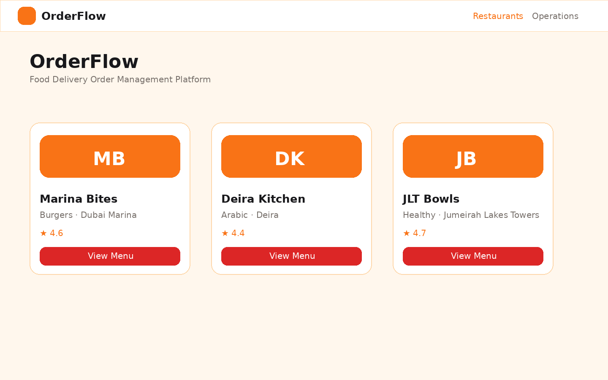
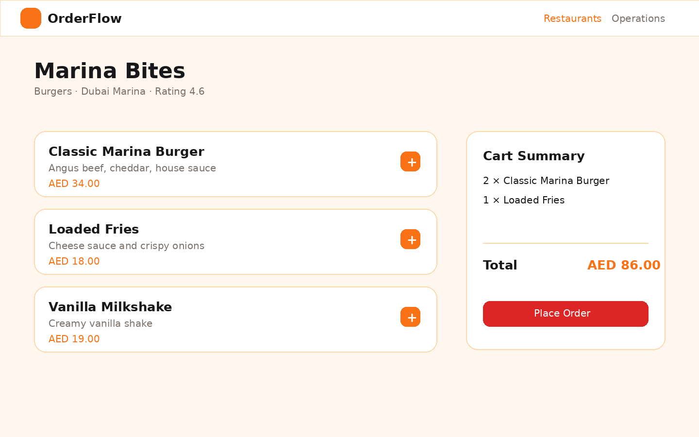
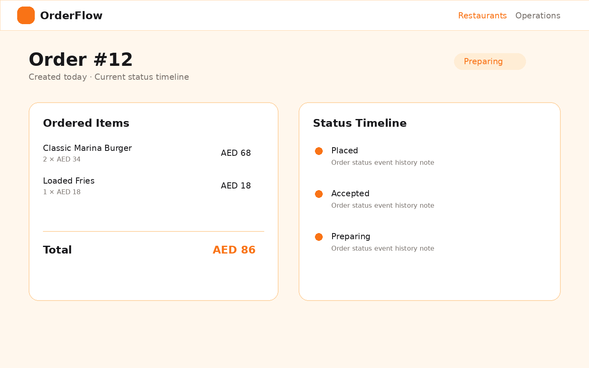
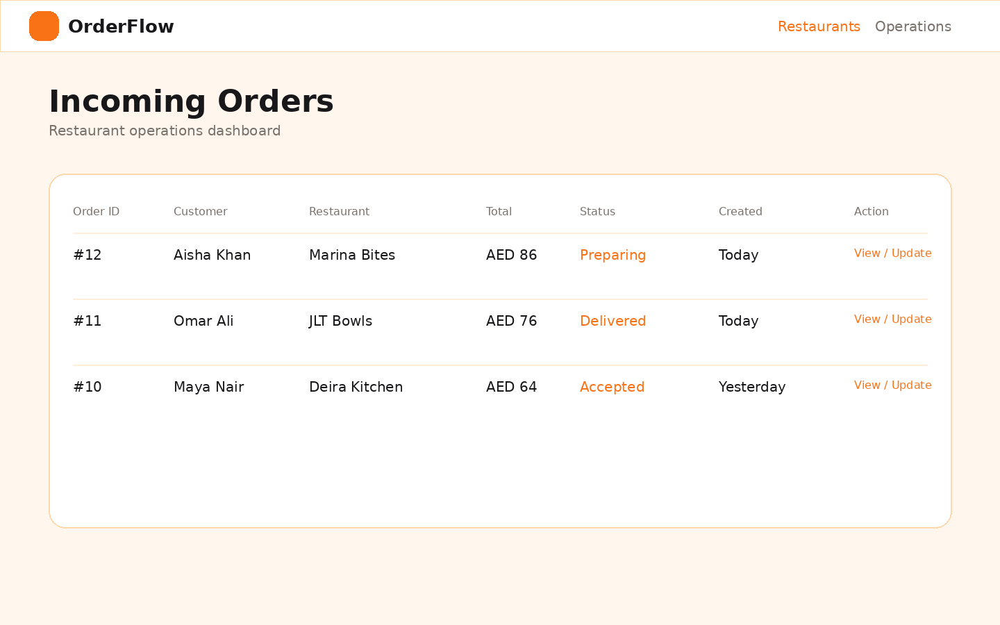
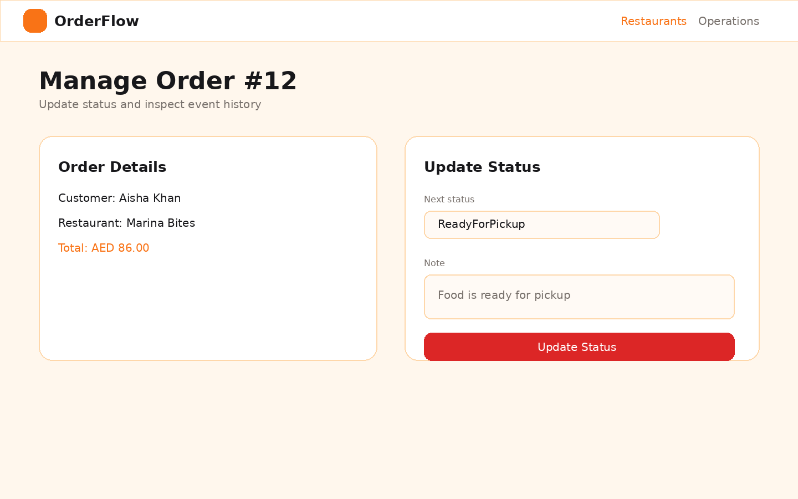
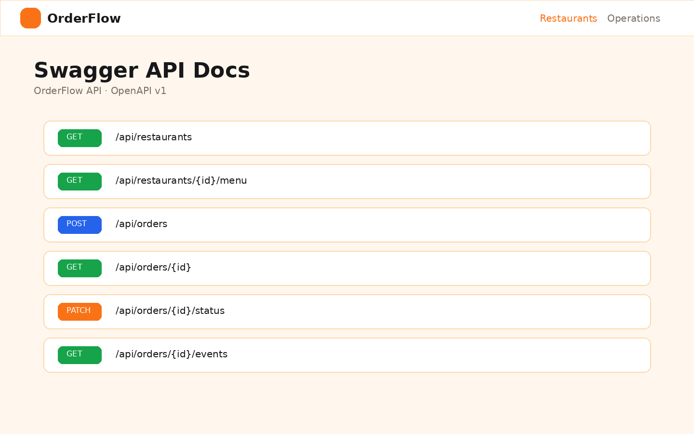

# OrderFlow — Full Stack Food Delivery Order Management Platform

OrderFlow is a full-stack food delivery order management platform designed to demonstrate product engineering, REST API design, database modeling, testing, and frontend/backend integration for software engineering roles.

It is built as a clean MVP for Software Engineer I - Full Stack and Software Engineer I - Backend roles at food delivery companies. The project focuses on real software engineering workflows: restaurant browsing, menu retrieval, cart flow, order placement, status tracking, operations dashboards, status lifecycle validation, seeded data, Swagger documentation, Docker setup, and backend tests.

> This is an original portfolio project inspired by common food delivery workflows. It does not use Talabat branding, logos, private data, or copyrighted design.

---

## Why This Project Was Built

Food delivery platforms need reliable systems for managing restaurants, menus, customers, orders, order items, and order status updates. OrderFlow demonstrates how a full-stack engineer can design and build a practical product workflow with clean backend services, relational database modeling, frontend integration, and automated tests.

This project is intentionally **not AI-focused**. It is a proper product engineering and backend/API design project.

---

## Tech Stack

### Backend

- C#
- ASP.NET Core Web API
- Entity Framework Core
- PostgreSQL
- Swagger / OpenAPI
- xUnit tests

### Frontend

- React
- TypeScript
- Vite
- Clean custom CSS
- Axios

### DevOps

- Docker Compose for PostgreSQL + backend API
- GitHub Actions for backend tests
- `.env.example`

---

## Architecture

```text
Customer / Operator Browser
        |
        v
React + TypeScript Frontend
        |
        | REST API calls
        v
ASP.NET Core Web API
        |
        | Controllers
        v
Service Layer
        |
        | Business rules:
        | - order total calculation
        | - menu availability validation
        | - order status transition validation
        v
Entity Framework Core
        |
        v
PostgreSQL Database
```

---

## Features

### Customer Features

- View active restaurants
- View restaurant menu
- Add menu items to cart
- Place an order
- View order confirmation
- Track order status timeline

### Restaurant / Operations Features

- View incoming orders
- View order details
- Update order status
- View order status event history

### Order Status Lifecycle

```text
Placed -> Accepted -> Preparing -> ReadyForPickup -> OutForDelivery -> Delivered
   |          |
   v          v
Cancelled  Cancelled
```

Backend transition rules:

- `Placed` can move to `Accepted` or `Cancelled`
- `Accepted` can move to `Preparing` or `Cancelled`
- `Preparing` can move to `ReadyForPickup`
- `ReadyForPickup` can move to `OutForDelivery`
- `OutForDelivery` can move to `Delivered`
- `Delivered` and `Cancelled` are terminal states

---

## API Endpoints

### Restaurants

| Method | Endpoint | Description |
|---|---|---|
| GET | `/api/restaurants` | Returns active restaurants |
| GET | `/api/restaurants/{id}` | Returns restaurant details |
| GET | `/api/restaurants/{id}/menu` | Returns available menu items |

### Orders

| Method | Endpoint | Description |
|---|---|---|
| POST | `/api/orders` | Creates a customer order |
| GET | `/api/orders/{id}` | Returns order details with items and customer |
| GET | `/api/orders` | Returns recent orders |
| PATCH | `/api/orders/{id}/status` | Updates order status |
| GET | `/api/orders/{id}/events` | Returns order status timeline |

### Create Order Example

```json
{
  "customer": {
    "name": "Aisha Khan",
    "phone": "+971501112233",
    "email": "aisha@example.com",
    "address": "Dubai Marina, Dubai"
  },
  "restaurantId": 1,
  "items": [
    {
      "menuItemId": 1,
      "quantity": 2
    },
    {
      "menuItemId": 3,
      "quantity": 1
    }
  ]
}
```

### Update Status Example

```json
{
  "newStatus": "Preparing",
  "note": "Restaurant started preparing the order"
}
```

---

## Database Schema

```text
Restaurant
- Id
- Name
- Cuisine
- Area
- Rating
- IsActive

MenuItem
- Id
- RestaurantId
- Name
- Description
- Price
- Category
- IsAvailable

Customer
- Id
- Name
- Phone
- Email
- Address

Order
- Id
- CustomerId
- RestaurantId
- Status
- TotalAmount
- CreatedAt
- UpdatedAt

OrderItem
- Id
- OrderId
- MenuItemId
- Quantity
- UnitPrice
- LineTotal

OrderStatusEvent
- Id
- OrderId
- OldStatus
- NewStatus
- Note
- CreatedAt
```

### Relationships

```text
Restaurant 1 -> many MenuItems
Restaurant 1 -> many Orders
Customer 1 -> many Orders
Order 1 -> many OrderItems
Order 1 -> many OrderStatusEvents
MenuItem 1 -> many OrderItems
```

---

## Seed Data

The backend seeds three restaurants with 4–5 menu items each:

1. **Marina Bites** — Burgers, Dubai Marina, rating 4.6
2. **Deira Kitchen** — Arabic, Deira, rating 4.4
3. **JLT Bowls** — Healthy, Jumeirah Lakes Towers, rating 4.7

---

## Screenshots

### Restaurant Listing


### Menu and Cart


### Order Tracking


### Operations Dashboard


### Order Status Management


### Swagger API Docs


---

## Folder Structure

```text
orderflow/
│
├── backend/
│   ├── OrderFlow.Api/
│   ├── OrderFlow.Tests/
│   └── OrderFlow.sln
│
├── frontend/
│   ├── src/
│   ├── package.json
│   └── vite.config.ts
│
├── docs/
│   └── images/
│
├── .github/
│   └── workflows/
│       └── backend-tests.yml
│
├── docker-compose.yml
├── README.md
├── .gitignore
└── .env.example
```

---

## Setup Instructions

### Prerequisites

Install:

- .NET 8 SDK
- Node.js 20+
- Docker Desktop
- PostgreSQL client tools are optional

Clone the repository:

```bash
git clone https://github.com/your-username/orderflow.git
cd orderflow
```

Create a local environment file:

```bash
cp .env.example .env
```

---

## Run with Docker

Start PostgreSQL and the backend API:

```bash
docker compose up --build
```

The backend will run at:

```text
http://localhost:8080
```

Swagger will be available at:

```text
http://localhost:8080/swagger
```

---

## Run Backend Locally

Start PostgreSQL with Docker:

```bash
docker compose up postgres
```

Run the API locally:

```bash
cd backend/OrderFlow.Api
dotnet restore
dotnet run
```

Swagger will usually be available at one of the URLs printed by ASP.NET Core, such as:

```text
http://localhost:5000/swagger
https://localhost:5001/swagger
```

---

## Run Frontend Locally

In a new terminal:

```bash
cd frontend
npm install
npm run dev
```

Frontend URL:

```text
http://localhost:5173
```

By default, the frontend expects the backend API at:

```text
http://localhost:8080/api
```

To change it, create `frontend/.env`:

```bash
VITE_API_BASE_URL=http://localhost:8080/api
```

---

## Run Backend Tests

```bash
cd backend
dotnet test OrderFlow.sln
```

Test coverage includes:

- Order creation calculates correct total
- Cannot place order with unavailable menu item
- Valid status transition works
- Invalid status transition is rejected
- Getting restaurant menu returns available items only

---

## GitHub Actions

The workflow at `.github/workflows/backend-tests.yml` runs on pushes and pull requests to `main`.

It performs:

1. Checkout repository
2. Setup .NET 8
3. Restore dependencies
4. Build backend
5. Run xUnit tests

---

## Future Improvements

- Add authentication and role-based authorization for customers/operators
- Add pagination and filtering for operations dashboard
- Add restaurant-level order assignment
- Add delivery partner entity and assignment workflow
- Add optimistic concurrency handling for status updates
- Add integration tests with Testcontainers and PostgreSQL
- Add frontend unit tests with Vitest and React Testing Library
- Add CI job for frontend build
- Add production deployment files

---

## Resume Bullets

### Full Stack Resume Bullet

Built OrderFlow, a full-stack food delivery order management platform using React, TypeScript, ASP.NET Core Web API, PostgreSQL, and REST APIs to support restaurant browsing, cart flow, order placement, and order tracking.

### Backend Resume Bullet

Developed backend services for order creation, menu retrieval, status transition validation, and order event tracking using C#, ASP.NET Core, Entity Framework Core, PostgreSQL, Swagger, and xUnit tests.

### Product Engineering Resume Bullet

Designed a product-focused order workflow with customer-facing pages, operations dashboard, status lifecycle management, seeded data, API documentation, and automated backend tests.

---

## Notes for Recruiters

OrderFlow demonstrates practical full-stack engineering skills:

- Product workflow design
- REST API design
- Clean backend service layer
- Relational database modeling
- EF Core relationships and constraints
- Swagger/OpenAPI documentation
- Frontend/backend integration
- Docker-based local development
- Automated backend testing
